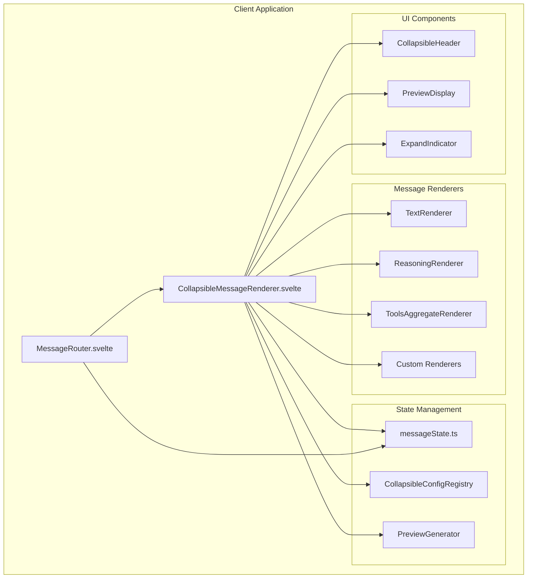
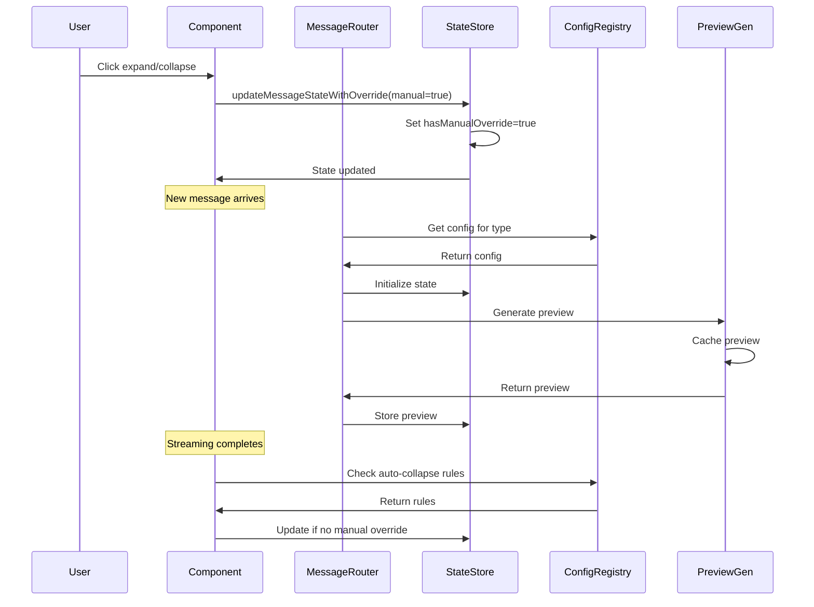

# Collapsible Message State System - Design Document

## Executive Summary

This document outlines the comprehensive design for the Collapsible Message State System, an intelligent framework for managing the display of AI agent conversations with multiple intermediate activities. The system will automatically manage expansion/collapse states, provide informative collapsed previews, and maintain a consistent, accessible user experience across all message types.

## Table of Contents

1. [System Architecture](#system-architecture)
2. [Component Design](#component-design)
3. [State Management Architecture](#state-management-architecture)
4. [Preview Generation System](#preview-generation-system)
5. [Integration Plan](#integration-plan)
6. [Technical Decisions](#technical-decisions)
7. [Migration Strategy](#migration-strategy)
8. [Performance Considerations](#performance-considerations)
9. [Security Considerations](#security-considerations)

## System Architecture

### High-Level Architecture



### Component Hierarchy

```
src/lib/
├── stores/
│   ├── messageState.ts (enhanced)
│   └── collapsibleConfig.ts (new)
├── components/
│   ├── MessageRouter.svelte (enhanced)
│   ├── CollapsibleMessageRenderer.svelte (enhanced)
│   ├── CollapsibleHeader.svelte (new)
│   ├── PreviewDisplay.svelte (new)
│   └── renderers/
│       ├── TextRenderer.svelte
│       ├── ReasoningRenderer.svelte (enhanced)
│       ├── ToolsCallAggregateRenderer.svelte (enhanced)
│       └── ToolCallRouter.svelte (enhanced)
├── utils/
│   ├── previewGenerator.ts (new)
│   └── collapsibleUtils.ts (new)
└── types/
    └── collapsible.ts (new)
```

## Component Design

### 1. Enhanced MessageState Store

```typescript
// stores/messageState.ts - Enhanced version
export interface MessageState {
  // Existing fields
  expanded: boolean;
  renderPhase: 'initial' | 'streaming' | 'enhanced' | 'complete';
  
  // New fields
  hasManualOverride?: boolean;     // Track manual user toggles
  collapsedPreview?: string;        // Cached preview text
  lastAutoAction?: 'expand' | 'collapse'; // Track last auto action
  streamingStartTime?: number;      // Track streaming duration
  errorState?: boolean;              // Track error states
}

export interface BatchUpdate {
  messageId: string;
  updates: Partial<MessageState>;
}

// New API functions
export function updateMessageStateWithOverride(
  messageId: string, 
  updates: Partial<MessageState>,
  isManualAction: boolean = false
): void;

export function batchUpdateMessageStates(
  updates: BatchUpdate[]
): void;

export function autoCollapseAllExcept(
  exceptMessageId: string,
  respectManualOverrides: boolean = true
): void;

export function generateAndCachePreview(
  messageId: string,
  message: RichMessageDto
): string;
```

### 2. CollapsibleConfig Registry

```typescript
// stores/collapsibleConfig.ts - New file
export interface CollapsibleConfig {
  messageType: string;
  autoCollapseOnComplete: boolean;
  autoExpandOnStream: boolean;
  previewLength: number;
  previewFormatter: (message: any) => string;
  collapsedIcon?: string;
  expandedIcon?: string;
  animationDuration?: number;
  showTimestamp?: boolean;
  allowManualToggle?: boolean;
}

export class CollapsibleConfigRegistry {
  private configs: Map<string, CollapsibleConfig>;
  
  constructor() {
    this.configs = new Map();
    this.registerDefaultConfigs();
  }
  
  private registerDefaultConfigs(): void {
    // Text messages
    this.register({
      messageType: 'text',
      autoCollapseOnComplete: false,
      autoExpandOnStream: true,
      previewLength: 100,
      previewFormatter: (msg) => msg.content?.substring(0, 100) || '',
      allowManualToggle: false
    });
    
    // Reasoning messages
    this.register({
      messageType: 'reasoning',
      autoCollapseOnComplete: true,
      autoExpandOnStream: true,
      previewLength: 60,
      previewFormatter: (msg) => {
        const reasoning = msg.reasoning || msg.content || '';
        return `Thinking: ${reasoning.substring(0, 60)}...`;
      },
      collapsedIcon: 'brain',
      allowManualToggle: true
    });
    
    // Tool call aggregates
    this.register({
      messageType: 'tools_aggregate',
      autoCollapseOnComplete: false,
      autoExpandOnStream: true,
      previewLength: 100,
      previewFormatter: (msg) => {
        const count = msg.toolCallPairs?.length || 0;
        const names = msg.toolCallPairs
          ?.slice(0, 3)
          .map(p => p.toolCall.name)
          .join(', ');
        const more = count > 3 ? ` +${count - 3} more` : '';
        return `Executed ${count} tool${count !== 1 ? 's' : ''}: ${names}${more}`;
      },
      collapsedIcon: 'tools',
      allowManualToggle: true,
      animationDuration: 300
    });
  }
  
  register(config: CollapsibleConfig): void {
    this.configs.set(config.messageType, config);
  }
  
  get(messageType: string): CollapsibleConfig | undefined {
    return this.configs.get(messageType);
  }
  
  getOrDefault(messageType: string): CollapsibleConfig {
    return this.configs.get(messageType) || this.getDefaultConfig();
  }
  
  private getDefaultConfig(): CollapsibleConfig {
    return {
      messageType: 'default',
      autoCollapseOnComplete: false,
      autoExpandOnStream: true,
      previewLength: 80,
      previewFormatter: (msg) => msg.content?.substring(0, 80) || 'Message',
      allowManualToggle: true
    };
  }
}

export const collapsibleConfigRegistry = new CollapsibleConfigRegistry();
```

### 3. Preview Generation System

```typescript
// utils/previewGenerator.ts - New file
export interface PreviewOptions {
  maxLength: number;
  includeEllipsis: boolean;
  stripMarkdown: boolean;
  preserveCodeBlocks: boolean;
}

export class PreviewGenerator {
  private cache: Map<string, string> = new Map();
  
  generatePreview(
    message: RichMessageDto,
    options: Partial<PreviewOptions> = {}
  ): string {
    const cacheKey = `${message.id}-${message.messageType}`;
    
    // Check cache first
    if (this.cache.has(cacheKey)) {
      return this.cache.get(cacheKey)!;
    }
    
    const config = collapsibleConfigRegistry.getOrDefault(message.messageType);
    const preview = config.previewFormatter(message);
    
    const finalOptions: PreviewOptions = {
      maxLength: config.previewLength,
      includeEllipsis: true,
      stripMarkdown: true,
      preserveCodeBlocks: false,
      ...options
    };
    
    const processed = this.processPreview(preview, finalOptions);
    this.cache.set(cacheKey, processed);
    
    return processed;
  }
  
  private processPreview(text: string, options: PreviewOptions): string {
    let result = text;
    
    // Strip markdown if requested
    if (options.stripMarkdown) {
      result = this.stripMarkdown(result);
    }
    
    // Truncate to max length
    if (result.length > options.maxLength) {
      result = result.substring(0, options.maxLength);
      
      // Try to break at word boundary
      const lastSpace = result.lastIndexOf(' ');
      if (lastSpace > options.maxLength * 0.8) {
        result = result.substring(0, lastSpace);
      }
      
      if (options.includeEllipsis) {
        result += '...';
      }
    }
    
    return result.trim();
  }
  
  private stripMarkdown(text: string): string {
    return text
      .replace(/#{1,6}\s+/g, '')           // Headers
      .replace(/\*\*([^*]+)\*\*/g, '$1')   // Bold
      .replace(/\*([^*]+)\*/g, '$1')       // Italic
      .replace(/\[([^\]]+)\]\([^)]+\)/g, '$1') // Links
      .replace(/`([^`]+)`/g, '$1')         // Inline code
      .replace(/^[-*+]\s+/gm, '')          // Lists
      .replace(/^\d+\.\s+/gm, '')          // Numbered lists
      .replace(/\n{2,}/g, ' ')             // Multiple newlines
      .trim();
  }
  
  clearCache(): void {
    this.cache.clear();
  }
  
  removeCacheEntry(messageId: string): void {
    // Remove all entries for this message
    for (const key of this.cache.keys()) {
      if (key.startsWith(`${messageId}-`)) {
        this.cache.delete(key);
      }
    }
  }
}

export const previewGenerator = new PreviewGenerator();
```

### 4. Enhanced CollapsibleMessageRenderer

```typescript
// Enhanced props interface
interface CollapsibleRendererProps {
  message: RichMessageDto;
  isLatest: boolean;
  expanded: boolean;
  renderPhase: RenderPhase;
  config?: CollapsibleConfig;
  onToggle?: (expanded: boolean, isManual: boolean) => void;
  onStateChange?: (state: Partial<MessageState>) => void;
}
```

Key enhancements:
- Integrated preview display
- Manual override tracking
- Keyboard navigation support
- ARIA attributes
- Loading states
- Error state handling

### 5. Tool Call Aggregate Handling

```typescript
// Enhanced ToolsCallAggregateRenderer
interface ToolCallAggregateState {
  overallExpanded: boolean;
  individualStates: Map<string, boolean>;
  executingTools: Set<string>;
  failedTools: Set<string>;
}
```

Features:
- Nested collapse states for individual tools
- Async result handling
- Error state display
- Loading indicators per tool

## State Management Architecture

### State Flow Diagram



### State Update Batching

```typescript
// Batch update implementation
class StateUpdateBatcher {
  private pendingUpdates: Map<string, Partial<MessageState>> = new Map();
  private timeoutId: number | null = null;
  private batchDelay = 50; // ms
  
  scheduleUpdate(messageId: string, updates: Partial<MessageState>): void {
    const existing = this.pendingUpdates.get(messageId) || {};
    this.pendingUpdates.set(messageId, { ...existing, ...updates });
    
    if (!this.timeoutId) {
      this.timeoutId = setTimeout(() => this.flush(), this.batchDelay);
    }
  }
  
  flush(): void {
    if (this.pendingUpdates.size === 0) return;
    
    const updates = Array.from(this.pendingUpdates.entries()).map(
      ([messageId, updates]) => ({ messageId, updates })
    );
    
    batchUpdateMessageStates(updates);
    
    this.pendingUpdates.clear();
    this.timeoutId = null;
  }
}
```

## Integration Plan

### Phase 1: Core Infrastructure (Week 1)

#### 1.1 Enhance Message State Store
- Add new fields (hasManualOverride, collapsedPreview, etc.)
- Implement batch update functionality
- Add override tracking logic
- Create state migration utilities

#### 1.2 Create CollapsibleConfig Registry
- Implement registry class
- Define default configurations
- Add registration API
- Create configuration validator

#### 1.3 Implement Preview Generation
- Create PreviewGenerator class
- Implement markdown stripping
- Add caching mechanism
- Create preview formatters for each type

### Phase 2: Component Updates (Week 2)

#### 2.1 Update CollapsibleMessageRenderer
- Integrate preview display
- Add manual override support
- Implement animation states
- Add error boundaries

#### 2.2 Enhance MessageRouter
- Add auto-expand/collapse logic
- Integrate with config registry
- Implement state change handlers
- Add performance optimizations

#### 2.3 Update Individual Renderers
- ReasoningRenderer: Add preview logic
- ToolsCallAggregateRenderer: Nested states
- ToolCallRouter: Individual collapse
- TextRenderer: Non-collapsible handling

### Phase 3: UX & Accessibility (Week 3)

#### 3.1 Animation System
- CSS transition classes
- Smooth height animations
- Loading state animations
- Error state transitions

#### 3.2 Keyboard Navigation
- Tab key support
- Enter/Space for toggle
- Escape to collapse
- Arrow keys for navigation

#### 3.3 ARIA Support
- aria-expanded attributes
- Role definitions
- Live regions for updates
- Screen reader announcements

#### 3.4 Visual Hierarchy
- Icon standardization
- Color coding by type
- Hover states
- Focus indicators

### Phase 4: Testing & Documentation (Week 4)

#### 4.1 Unit Tests
- State store tests
- Preview generator tests
- Config registry tests
- Component logic tests

#### 4.2 Integration Tests
- Message flow tests
- State synchronization
- Streaming scenarios
- Error recovery

#### 4.3 E2E Tests
- User interaction flows
- Keyboard navigation
- Accessibility compliance
- Performance benchmarks

#### 4.4 Documentation
- API documentation
- Integration guides
- Migration instructions
- Best practices

## Technical Decisions

### 1. State Management Approach

**Decision**: Centralized Svelte stores with derived states

**Rationale**:
- Consistent with existing architecture
- Excellent performance with fine-grained reactivity
- Easy to test and debug
- Supports time-travel debugging

**Alternatives Considered**:
- Component-local state: Rejected due to synchronization complexity
- Context API: Not needed given Svelte's store system
- Redux-style: Over-engineering for this use case

### 2. Animation Strategy

**Decision**: CSS transitions with Svelte's built-in transition API

**Rationale**:
- Hardware accelerated
- Smooth 60fps performance
- Declarative and maintainable
- Accessibility-friendly

**Implementation**:
```css
.collapsible-content {
  transition: height 200ms cubic-bezier(0.4, 0, 0.2, 1),
              opacity 200ms ease-out;
  overflow: hidden;
}

.collapsed {
  height: 48px;
  opacity: 0.9;
}

.expanded {
  height: auto;
  opacity: 1;
}
```

### 3. Preview Caching Strategy

**Decision**: In-memory Map with LRU eviction

**Rationale**:
- Fast O(1) lookups
- Automatic memory management
- Simple implementation
- No persistence needed

**Implementation**:
```typescript
class LRUCache<K, V> {
  private maxSize: number;
  private cache: Map<K, V>;
  
  constructor(maxSize: number = 1000) {
    this.maxSize = maxSize;
    this.cache = new Map();
  }
  
  get(key: K): V | undefined {
    const value = this.cache.get(key);
    if (value !== undefined) {
      // Move to end (most recently used)
      this.cache.delete(key);
      this.cache.set(key, value);
    }
    return value;
  }
  
  set(key: K, value: V): void {
    if (this.cache.size >= this.maxSize) {
      // Remove least recently used (first item)
      const firstKey = this.cache.keys().next().value;
      this.cache.delete(firstKey);
    }
    this.cache.set(key, value);
  }
}
```

### 4. Extensibility Pattern

**Decision**: Registry pattern with plugin architecture

**Rationale**:
- Easy to add new message types
- No core code changes needed
- Runtime registration support
- Type-safe with TypeScript

### 5. Performance Optimizations

**Decisions**:
1. **Virtual scrolling**: For conversations > 100 messages
2. **Batch updates**: 50ms debounce for state changes
3. **Lazy loading**: Components loaded on-demand
4. **Preview caching**: Avoid regeneration
5. **CSS containment**: Isolate layout calculations

## Migration Strategy

### Phase-Based Rollout

#### Phase 1: Feature Flag Introduction
```typescript
// config/features.ts
export const features = {
  enhancedCollapsible: {
    enabled: import.meta.env.VITE_ENHANCED_COLLAPSIBLE === 'true',
    manualOverrides: true,
    previewGeneration: true,
    batchUpdates: true,
    autoCollapseRules: false
  }
};
```

#### Phase 2: Gradual Feature Enablement
1. Week 1: Enable for internal testing
2. Week 2: Enable for 10% of users
3. Week 3: Enable for 50% of users
4. Week 4: Full rollout

#### Phase 3: Legacy Code Removal
- Maintain backward compatibility for 2 releases
- Deprecation warnings in console
- Migration guide for custom renderers
- Automated migration scripts

### Backward Compatibility

```typescript
// Compatibility wrapper
export function createCompatibleRenderer(
  legacyRenderer: any
): MessageRenderer {
  return {
    messageType: legacyRenderer.type || 'unknown',
    render: async (message, context) => {
      // Adapt legacy renderer
      if (legacyRenderer.render) {
        return legacyRenderer.render(message);
      }
      // Fallback
      return defaultRenderer.render(message, context);
    }
  };
}
```

### Data Migration

```typescript
// Migration script
export async function migrateMessageStates(): Promise<void> {
  const oldStates = get(messageStates);
  const newStates: MessageStates = {};
  
  for (const [id, state] of Object.entries(oldStates)) {
    newStates[id] = {
      ...state,
      hasManualOverride: false,
      collapsedPreview: undefined,
      lastAutoAction: undefined
    };
  }
  
  messageStates.set(newStates);
}
```

## Performance Considerations

### Rendering Performance

1. **Minimize Re-renders**
   - Use derived stores for computed values
   - Implement shouldUpdate checks
   - Batch DOM updates

2. **Optimize Animations**
   - Use CSS transforms over height changes
   - Implement will-change hints
   - Debounce rapid toggles

3. **Memory Management**
   - Limit preview cache size (1000 entries)
   - Clean up message states on unmount
   - Use WeakMap for component references

### Load Time Optimization

1. **Code Splitting**
   ```typescript
   // Lazy load heavy components
   const HeavyRenderer = lazy(() => import('./HeavyRenderer.svelte'));
   ```

2. **Bundle Size**
   - Tree-shake unused configs
   - Minify preview formatters
   - Extract common utilities

### Runtime Performance Metrics

```typescript
// Performance monitoring
export class PerformanceMonitor {
  private metrics: Map<string, number[]> = new Map();
  
  measure(name: string, fn: () => void): void {
    const start = performance.now();
    fn();
    const duration = performance.now() - start;
    
    if (!this.metrics.has(name)) {
      this.metrics.set(name, []);
    }
    this.metrics.get(name)!.push(duration);
    
    // Log slow operations
    if (duration > 16) { // Longer than one frame
      console.warn(`Slow operation: ${name} took ${duration.toFixed(2)}ms`);
    }
  }
  
  getStats(name: string): { avg: number; max: number; min: number } {
    const values = this.metrics.get(name) || [];
    if (values.length === 0) return { avg: 0, max: 0, min: 0 };
    
    return {
      avg: values.reduce((a, b) => a + b, 0) / values.length,
      max: Math.max(...values),
      min: Math.min(...values)
    };
  }
}
```

## Security Considerations

### XSS Prevention

1. **Preview Sanitization**
   ```typescript
   import DOMPurify from 'isomorphic-dompurify';
   
   function sanitizePreview(text: string): string {
     return DOMPurify.sanitize(text, {
       ALLOWED_TAGS: [],
       ALLOWED_ATTR: [],
       KEEP_CONTENT: true
     });
   }
   ```

2. **Content Security Policy**
   - Restrict inline scripts
   - Validate message content
   - Escape user input

### State Tampering Protection

1. **Validate State Updates**
   ```typescript
   function validateStateUpdate(
     updates: Partial<MessageState>
   ): boolean {
     // Check for valid fields
     const validFields = [
       'expanded', 'renderPhase', 'hasManualOverride',
       'collapsedPreview', 'lastAutoAction'
     ];
     
     return Object.keys(updates).every(
       key => validFields.includes(key)
     );
   }
   ```

2. **Rate Limiting**
   - Limit toggle frequency
   - Throttle batch updates
   - Prevent state flooding

### Privacy Considerations

1. **No Sensitive Data in Previews**
   - Strip PII from previews
   - Limit preview length
   - Sanitize tool parameters

2. **Secure State Storage**
   - No localStorage for sensitive data
   - Clear states on logout
   - Encrypt if persisting

## API Contracts

### Store API

```typescript
// Enhanced messageState.ts API
export interface MessageStateAPI {
  // State updates
  updateMessageState(messageId: string, updates: Partial<MessageState>): void;
  updateMessageStateWithOverride(
    messageId: string,
    updates: Partial<MessageState>,
    isManualAction: boolean
  ): void;
  batchUpdateMessageStates(updates: BatchUpdate[]): void;
  
  // State queries
  getMessageState(messageId: string): MessageState;
  isManuallyOverridden(messageId: string): boolean;
  getCollapsedPreview(messageId: string): string | undefined;
  
  // Bulk operations
  autoCollapseAllExcept(exceptId: string, respectOverrides?: boolean): void;
  expandAll(): void;
  collapseAll(): void;
  
  // Cleanup
  cleanupMessageState(messageId: string): void;
  clearAllStates(): void;
}
```

### Component Events

```typescript
// Event interfaces
export interface CollapsibleEvents {
  'collapse:toggle': {
    messageId: string;
    expanded: boolean;
    isManual: boolean;
  };
  'collapse:auto': {
    messageId: string;
    reason: 'streaming' | 'complete' | 'new-latest';
  };
  'collapse:batch': {
    messageIds: string[];
    expanded: boolean;
  };
  'preview:generated': {
    messageId: string;
    preview: string;
  };
}
```

### Registry API

```typescript
export interface CollapsibleConfigAPI {
  register(config: CollapsibleConfig): void;
  unregister(messageType: string): void;
  get(messageType: string): CollapsibleConfig | undefined;
  getOrDefault(messageType: string): CollapsibleConfig;
  listTypes(): string[];
  updateConfig(messageType: string, updates: Partial<CollapsibleConfig>): void;
  resetToDefaults(): void;
}
```

## Conclusion

This design provides a comprehensive, extensible, and performant solution for the Collapsible Message State System. The phased implementation approach ensures smooth migration from the existing system while maintaining backward compatibility. The architecture supports future enhancements and custom message types without requiring core system changes.

Key benefits:
- **User Experience**: Intelligent auto-collapse with manual override support
- **Performance**: Optimized rendering with batching and caching
- **Accessibility**: Full keyboard and screen reader support
- **Extensibility**: Easy addition of new message types
- **Maintainability**: Clear separation of concerns and testable components