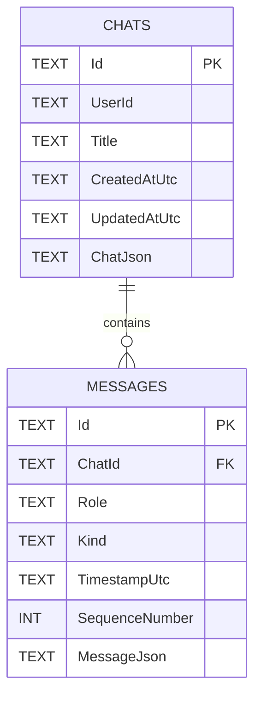
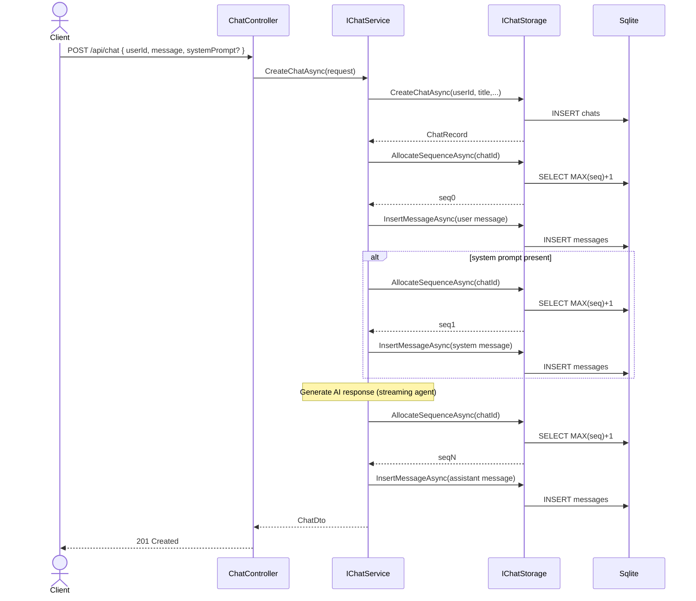
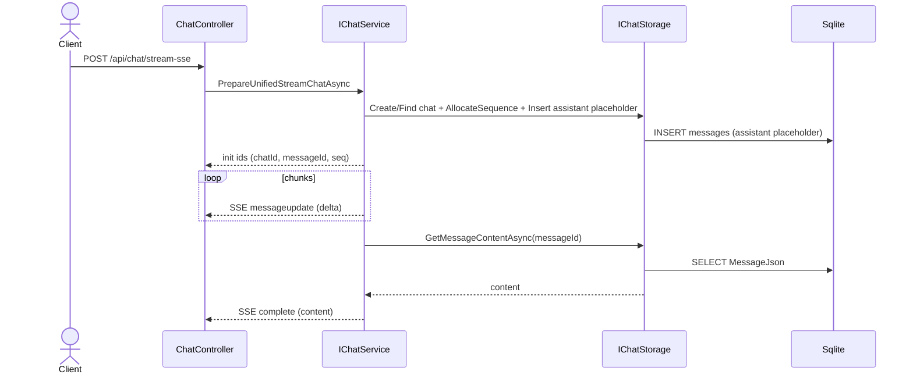
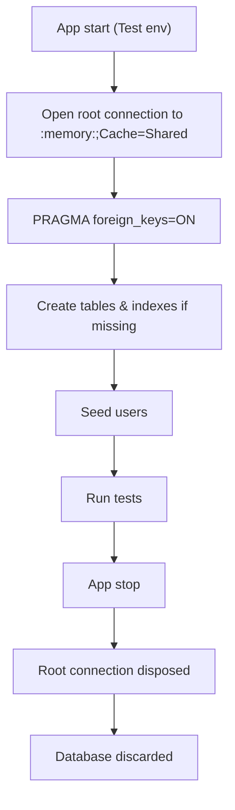

# Design: Manual CRUD Storage (Sqlite v1)

## Goals
- Remove EF from runtime paths and replace with manual Sqlite CRUD.
- Keep `IChatService` API stable; swap persistence under the service.
- Use JSON columns for flexible payloads; keep critical metadata as columns.
- Support Test env with in-memory Sqlite and clean state on restart.

## Architecture
- Service layer: `IChatService` remains the application API boundary used by controllers.
- New storage abstraction:
  - `IChatStorage`
    - Chats: Create, GetById, GetHistoryByUser (paged), Delete
    - Messages: Insert, ListByChatOrdered, GetById, GetContentById, AllocateSequence(chatId)
  - `SqliteChatStorage` (ADO.NET via `Microsoft.Data.Sqlite`)
    - Parameterized SQL, transactions for multi-step flows.
- DTO JSON strategy:
  - `messages.MessageJson` stores full polymorphic `MessageDto` including discriminator.
  - `messages.Kind` is required and mirrors discriminator for fast filtering/indexing when needed.
  - `chats.ChatJson` stores optional per-chat config and experimental fields.

## Schema
- `chats`: `Id`, `UserId`, `Title`, `CreatedAtUtc`, `UpdatedAtUtc`, `ChatJson`, index `(UserId, UpdatedAtUtc desc)`
- `messages`: `Id`, `ChatId` (FK cascade), `Role`, `Kind`, `TimestampUtc`, `SequenceNumber`, `MessageJson`,
  - unique `(ChatId, SequenceNumber)`, index `(ChatId, TimestampUtc)`
- Allowed values (extensible):
  - Role: `user`, `assistant`, `tool`, `system`
  - Kind: `text`, `reasoning` (near-future: `toolcall`, `toolresult`)

## Startup wiring
- Replace EF registrations in `Program.cs` with:
  - Scoped `IChatStorage` -> `SqliteChatStorage` using connection string from `ConnectionStrings:DefaultConnection`.
  - Remove `AIChatDbContext` and migrations code paths.
  - Test env: use `Data Source=:memory:;Cache=Shared`, open a root connection for app lifetime, ensure schema on start, reseed users.
- Keep existing `IChatService` and `IStreamingAgent` registrations.

## Sequence allocation
- Inside `SqliteChatStorage`:
  - Allocate in a transaction: `SELECT IFNULL(MAX(SequenceNumber), -1) + 1 FROM messages WHERE ChatId=?;` then insert with that value.
  - Handle unique constraint conflict with a single retry.

## Migration plan (big-bang)
1. Add `IChatStorage` interface and `SqliteChatStorage` implementation.
2. Implement schema creation helper (idempotent) and user seeding.
3. Update `Program.cs` to wire `IChatStorage`, remove EF DbContext and migration code.
4. Refactor `ChatService` to use `IChatStorage` instead of EF:
   - CreateChatAsync: create chat, allocate sequences, insert messages, return DTOs.
   - GetChatAsync: fetch chat, list messages ordered by sequence, map to DTOs.
   - GetChatHistoryAsync: page chats by user with latest update time.
   - DeleteChatAsync: cascade removes messages via FK.
   - Streaming paths: create assistant message placeholder, stream updates, fetch final content.
5. Remove `MessageSequenceService` or make it a thin pass-through to storage if still needed by interface.
6. Ensure Test env uses in-memory and resets on start.
7. Remove EF-specific files from build (DbContext, Migrations) but keep models for DTO shape; or relocate EF annotations if desired.

## Error handling and logging
- All storage methods return rich errors with context.
- Parameterize all SQL to avoid injection.
- Log at Information for operations and at Error for failures.

## Open items (future)
- Add `ToolCall`/`ToolResult` kinds persistence logic once implemented in DTOs.
- Consider JSON path indexes if we start querying inside JSON fields.
- Add additional indexes if query patterns demand.

## Interfaces (data access)

```csharp
public interface IChatStorage
{
    // Chats
    Task<(bool Success, string? Error, ChatRecord? Chat)> CreateChatAsync(string userId, string title, DateTime createdAtUtc, DateTime updatedAtUtc, string? chatJson, CancellationToken ct = default);
    Task<(bool Success, string? Error, ChatRecord? Chat)> GetChatByIdAsync(string chatId, CancellationToken ct = default);
    Task<(bool Success, string? Error, IReadOnlyList<ChatRecord> Chats, int TotalCount)> GetChatHistoryByUserAsync(string userId, int page, int pageSize, CancellationToken ct = default);
    Task<(bool Success, string? Error)> DeleteChatAsync(string chatId, CancellationToken ct = default);

    // Messages
    Task<(bool Success, string? Error, int NextSequence)> AllocateSequenceAsync(string chatId, CancellationToken ct = default);
    Task<(bool Success, string? Error, MessageRecord? Message)> InsertMessageAsync(MessageRecord message, CancellationToken ct = default);
    Task<(bool Success, string? Error, IReadOnlyList<MessageRecord> Messages)> ListChatMessagesOrderedAsync(string chatId, CancellationToken ct = default);
    Task<(bool Success, string? Error, MessageRecord? Message)> GetMessageByIdAsync(string messageId, CancellationToken ct = default);
    Task<(bool Success, string? Error, string? Content)> GetMessageContentAsync(string messageId, CancellationToken ct = default);
}

public sealed class ChatRecord
{
    public required string Id { get; init; }
    public required string UserId { get; init; }
    public required string Title { get; init; }
    public required DateTime CreatedAtUtc { get; init; }
    public required DateTime UpdatedAtUtc { get; init; }
    public string? ChatJson { get; init; }
}

public sealed class MessageRecord
{
    public required string Id { get; init; }
    public required string ChatId { get; init; }
    public required string Role { get; init; }      // user|assistant|tool|system
    public required string Kind { get; init; }      // text|reasoning|toolcall|toolresult (extensible)
    public required DateTime TimestampUtc { get; init; }
    public required int SequenceNumber { get; init; }
    public required string MessageJson { get; init; }
}
```

Notes:
- Methods return tuples with Success/Error for simplicity in the design doc; actual implementation may use Result types.
- `GetMessageContentAsync` is a convenience that extracts the primary text field for SSE completion, if applicable.

## Table schemas (DDL reference)

```sql
-- chats
CREATE TABLE IF NOT EXISTS chats (
  Id TEXT PRIMARY KEY,
  UserId TEXT NOT NULL,
  Title TEXT NOT NULL,
  CreatedAtUtc TEXT NOT NULL,
  UpdatedAtUtc TEXT NOT NULL,
  ChatJson TEXT NULL
);
CREATE INDEX IF NOT EXISTS idx_chats_user_updated ON chats (UserId, UpdatedAtUtc DESC);

-- messages
CREATE TABLE IF NOT EXISTS messages (
  Id TEXT PRIMARY KEY,
  ChatId TEXT NOT NULL,
  Role TEXT NOT NULL,
  Kind TEXT NOT NULL,
  TimestampUtc TEXT NOT NULL,
  SequenceNumber INTEGER NOT NULL,
  MessageJson TEXT NOT NULL,
  FOREIGN KEY (ChatId) REFERENCES chats (Id) ON DELETE CASCADE
);
CREATE UNIQUE INDEX IF NOT EXISTS ux_messages_chat_sequence ON messages (ChatId, SequenceNumber);
CREATE INDEX IF NOT EXISTS idx_messages_chat_ts ON messages (ChatId, TimestampUtc);
```

## Diagrams

### Entity relationship diagram


### Sequence: Create new chat


### Sequence: Streaming assistant response (SSE)


### Flow: Test environment database lifecycle


