# Development Specification: Rich Message Rendering

## Architecture Overview

The Rich Message Rendering system follows a **Component-Strategy-Observer** architectural pattern that enables incremental development while maintaining clean separation of concerns. The system is designed around core abstractions that allow each implementation phase to build upon previous work without requiring architectural refactoring.

### System Architecture Diagram

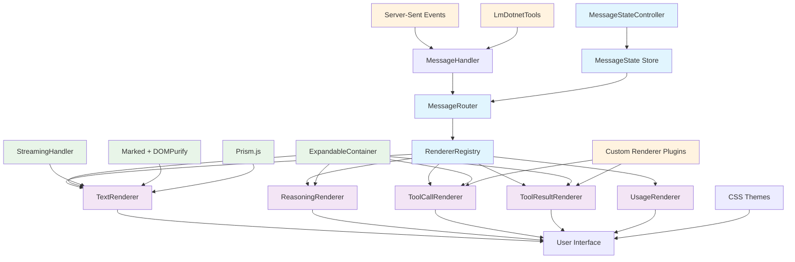

### Core Design Principles

1. **Interface Segregation**: Small, focused interfaces for each concern
2. **Progressive Enhancement**: Each phase adds capabilities without breaking existing functionality
3. **Composition Over Inheritance**: Components compose smaller, focused behaviors
4. **Dependency Inversion**: High-level modules depend on abstractions, not concretions
5. **Single Responsibility**: Each component has one clear purpose

## Core Abstractions

### Component Interaction Flow

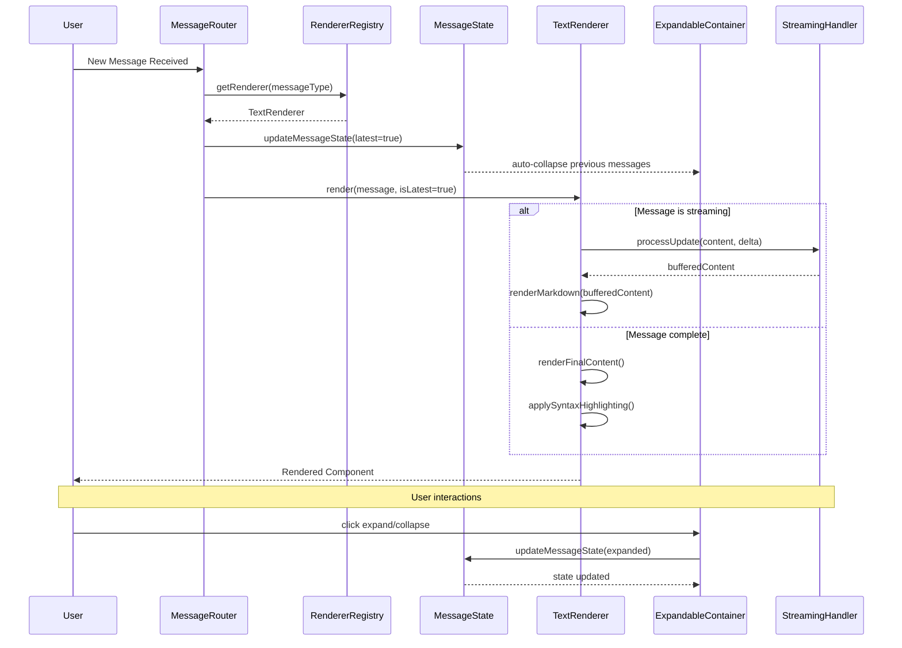

### Interface Hierarchy

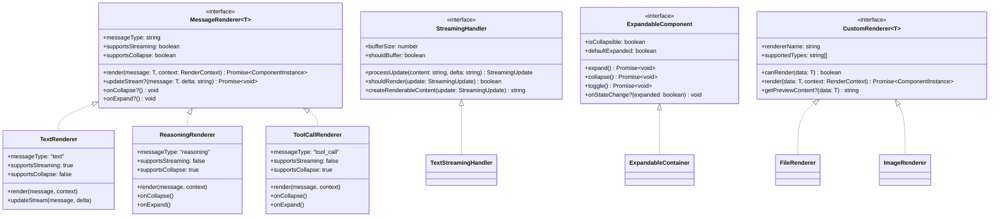

### 1. MessageRenderer Interface

The foundation interface that all message renderers implement:

```typescript
interface MessageRenderer<T extends MessageDto> {
  readonly messageType: string;
  readonly supportsStreaming: boolean;
  readonly supportsCollapse: boolean;
  
  render(message: T, context: RenderContext): Promise<ComponentInstance>;
  updateStream?(message: T, delta: string): Promise<void>;
  onCollapse?(): void;
  onExpand?(): void;
}
```

### 2. StreamingHandler Interface

Manages incremental content updates during streaming:

```typescript
interface StreamingHandler {
  readonly bufferSize: number;
  readonly shouldBuffer: boolean;
  
  processUpdate(content: string, delta: string): StreamingUpdate;
  shouldRender(update: StreamingUpdate): boolean;
  createRenderableContent(update: StreamingUpdate): string;
}
```

### 3. ExpandableComponent Interface

Handles expand/collapse behavior:

```typescript
interface ExpandableComponent {
  readonly isCollapsible: boolean;
  readonly defaultExpanded: boolean;
  
  expand(): Promise<void>;
  collapse(): Promise<void>;
  toggle(): Promise<void>;
  
  onStateChange?(expanded: boolean): void;
}
```

### 4. CustomRenderer Interface

Plugin interface for extensible rendering:

```typescript
interface CustomRenderer<T = any> {
  readonly rendererName: string;
  readonly supportedTypes: string[];
  
  canRender(data: T): boolean;
  render(data: T, context: RenderContext): Promise<ComponentInstance>;
  getPreviewContent?(data: T): string;
}
```

## Component Design

### MessageRouter Component

**Purpose**: Central routing component that delegates to appropriate renderers
**Phase**: 1 (MVP Foundation)

```svelte
<!-- MessageRouter.svelte -->
<script lang="ts">
  import { getRenderer } from './renderers/RendererRegistry';
  import type { MessageDto } from './types';
  
  export let message: MessageDto;
  export let isLatest: boolean = false;
  export let onStateChange: (messageId: string, state: MessageState) => void;
  
  $: renderer = getRenderer(message.messageType);
  $: Component = renderer.component;
</script>

<svelte:component 
  this={Component} 
  {message} 
  {isLatest}
  {onStateChange}
  renderer={renderer}
/>
```

**Key Features**:
- Dynamic component resolution
- State change propagation
- Renderer registry integration
- Clean prop passing

### ExpandableContainer Component

**Purpose**: Shared expand/collapse behavior across message types
**Phase**: 1 (MVP Foundation)

```svelte
<!-- ExpandableContainer.svelte -->
<script lang="ts">
  import { fly } from 'svelte/transition';
  import { quintOut } from 'svelte/easing';
  
  export let expanded: boolean = true;
  export let collapsible: boolean = true;
  export let title: string = '';
  export let isLatest: boolean = false;
  
  // Auto-collapse logic
  $: if (!isLatest && collapsible) {
    expanded = false;
  }
  
  function toggle() {
    if (collapsible) {
      expanded = !expanded;
    }
  }
</script>

<div class="expandable-container" class:expanded class:collapsible>
  {#if collapsible}
    <button 
      class="header" 
      on:click={toggle}
      aria-expanded={expanded}
      aria-controls="content"
    >
      <span class="toggle-icon" class:expanded>
        {expanded ? '▼' : '▶'}
      </span>
      <span class="title">{title}</span>
    </button>
  {/if}
  
  {#if expanded}
    <div 
      id="content"
      class="content"
      transition:fly="{{ y: -10, duration: 200, easing: quintOut }}"
    >
      <slot />
    </div>
  {/if}
</div>
```

### TextRenderer Component

**Purpose**: Handles text messages with markdown and streaming
**Phase**: 2-3 (Enhanced Text + Syntax Highlighting)

```svelte
<!-- TextRenderer.svelte -->
<script lang="ts">
  import { marked } from 'marked';
  import DOMPurify from 'dompurify';
  import { createStreamingHandler } from '../streaming/TextStreamingHandler';
  import { onMount, afterUpdate } from 'svelte';
  import Prism from 'prismjs';
  
  export let message: TextMessageDto;
  export let isLatest: boolean = false;
  
  let contentElement: HTMLElement;
  let renderedContent: string = '';
  
  const streamingHandler = createStreamingHandler({
    bufferSize: 50, // ~sentence length
    shouldBuffer: true
  });
  
  $: {
    if (message.isStreaming && isLatest) {
      handleStreamingUpdate();
    } else {
      renderFinalContent();
    }
  }
  
  async function handleStreamingUpdate() {
    const update = streamingHandler.processUpdate(renderedContent, message.content);
    if (streamingHandler.shouldRender(update)) {
      renderedContent = DOMPurify.sanitize(
        marked.parse(streamingHandler.createRenderableContent(update))
      );
    }
  }
  
  async function renderFinalContent() {
    renderedContent = DOMPurify.sanitize(marked.parse(message.content));
  }
  
  afterUpdate(() => {
    if (contentElement && !message.isStreaming) {
      Prism.highlightAllUnder(contentElement);
    }
  });
</script>

<div class="text-message" class:streaming={message.isStreaming}>
  <div bind:this={contentElement} class="content prose">
    {@html renderedContent}
  </div>
</div>
```

### ReasoningRenderer Component

**Purpose**: Collapsible reasoning display with auto-collapse
**Phase**: 4 (Full Message Types)

```svelte
<!-- ReasoningRenderer.svelte -->
<script lang="ts">
  import ExpandableContainer from '../shared/ExpandableContainer.svelte';
  import type { ReasoningMessageDto } from '../types';
  
  export let message: ReasoningMessageDto;
  export let isLatest: boolean = false;
  
  $: expanded = isLatest;
</script>

<ExpandableContainer 
  {expanded}
  collapsible={true}
  title="Reasoning"
  {isLatest}
>
  <div class="reasoning-content">
    <pre class="reasoning-text">{message.content}</pre>
  </div>
</ExpandableContainer>

<style>
  .reasoning-content {
    max-height: 300px;
    overflow-y: auto;
    padding: 1rem;
    background: var(--surface-variant);
    border-radius: 0.5rem;
  }
  
  .reasoning-text {
    white-space: pre-wrap;
    font-family: var(--font-mono);
    font-size: 0.875rem;
    line-height: 1.5;
    margin: 0;
  }
</style>
```

## State Management Architecture

### Message State Flow

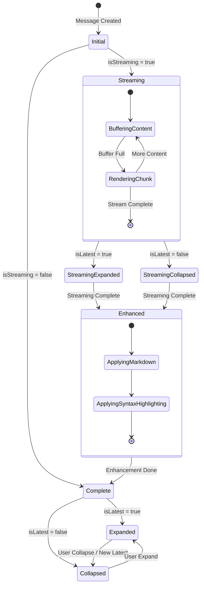

### Expand/Collapse State Management

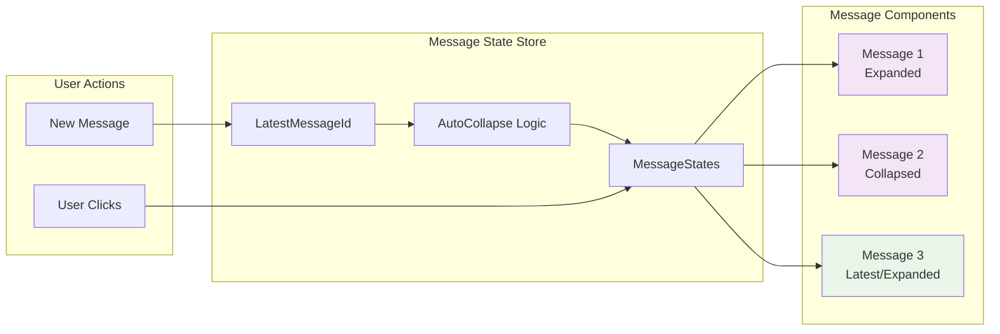

### MessageState Store

Centralized state management for message rendering states:

```typescript
// stores/messageState.ts
import { writable, derived } from 'svelte/store';

interface MessageState {
  expanded: boolean;
  isLatest: boolean;
  isStreaming: boolean;
  renderPhase: 'initial' | 'streaming' | 'enhanced' | 'complete';
}

interface MessageStates {
  [messageId: string]: MessageState;
}

export const messageStates = writable<MessageStates>({});

export const latestMessageId = writable<string | null>(null);

// Derived store for auto-collapse logic
export const shouldAutoCollapse = derived(
  [messageStates, latestMessageId],
  ([$states, $latestId]) => {
    return (messageId: string) => {
      const state = $states[messageId];
      return state && messageId !== $latestId && state.expanded;
    };
  }
);

// Actions
export function updateMessageState(messageId: string, updates: Partial<MessageState>) {
  messageStates.update(states => ({
    ...states,
    [messageId]: { ...states[messageId], ...updates }
  }));
}

export function setLatestMessage(messageId: string) {
  latestMessageId.set(messageId);
  
  // Auto-collapse previous messages
  messageStates.update(states => {
    const newStates = { ...states };
    Object.keys(newStates).forEach(id => {
      if (id !== messageId && newStates[id].expanded) {
        newStates[id] = { ...newStates[id], expanded: false, isLatest: false };
      }
    });
    
    // Ensure latest message is expanded
    if (newStates[messageId]) {
      newStates[messageId] = { ...newStates[messageId], expanded: true, isLatest: true };
    }
    
    return newStates;
  });
}
```

## Phase Implementation Plans

### Implementation Timeline Overview

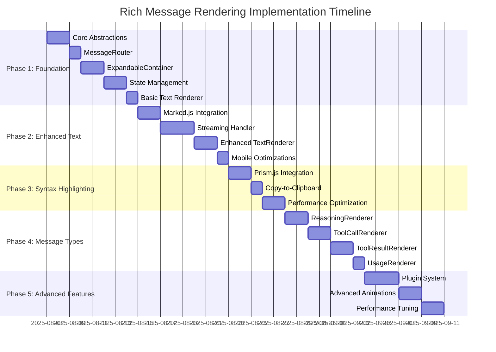

### Streaming Data Flow

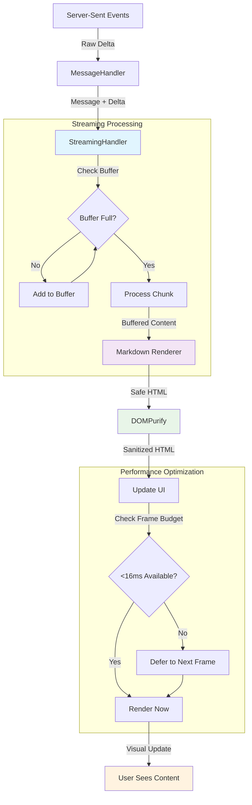

### Component Lifecycle

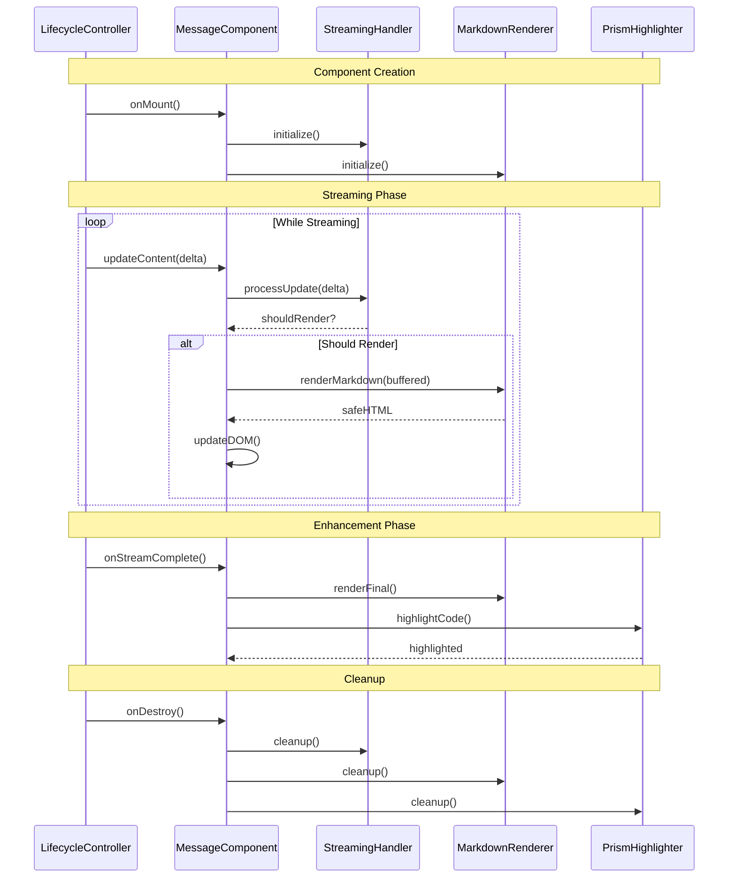

### Phase 1: Basic Expand/Collapse Foundation
**Timeline**: Week 1-2  
**Goal**: Core architecture with basic expand/collapse

#### Tasks:
1. **Create Core Abstractions** (2 days)
   - Define TypeScript interfaces
   - Create base component contracts
   - Set up renderer registry

2. **Implement MessageRouter** (1 day)
   - Dynamic component resolution
   - Basic prop passing
   - Renderer registration

3. **Build ExpandableContainer** (2 days)
   - Expand/collapse animations
   - Touch-optimized interactions
   - Accessibility support (ARIA attributes)

4. **Create State Management** (2 days)
   - Svelte stores for message states
   - Auto-collapse logic
   - State persistence

5. **Basic Text Renderer** (1 day)
   - Simple text display
   - No markdown (plain text only)
   - Integration with ExpandableContainer

#### Acceptance Criteria:
- ✅ Messages can expand/collapse manually
- ✅ Latest message auto-expands
- ✅ Previous messages auto-collapse
- ✅ Touch-friendly interactions work
- ✅ Basic message routing functions

### Phase 2: Enhanced Text Rendering
**Timeline**: Week 3-4  
**Goal**: Markdown parsing with streaming optimization

#### Tasks:
1. **Integrate Marked.js + DOMPurify** (2 days)
   - Safe markdown parsing
   - XSS prevention
   - Performance optimization

2. **Implement Streaming Handler** (3 days)
   - Sentence-level buffering
   - Incremental markdown rendering
   - Smooth visual transitions

3. **Enhanced TextRenderer** (2 days)
   - Replace plain text with markdown
   - Streaming vs final render modes
   - Performance monitoring

4. **Mobile Optimizations** (1 day)
   - Touch interaction refinements
   - Responsive design improvements
   - Performance testing on devices

#### Acceptance Criteria:
- ✅ Markdown renders correctly and safely
- ✅ Streaming updates smooth without jarring transitions
- ✅ Sentence-level buffering works
- ✅ Mobile interactions optimized

### Phase 3: Syntax Highlighting
**Timeline**: Week 5  
**Goal**: Code block highlighting with copy functionality

#### Tasks:
1. **Integrate Prism.js** (2 days)
   - Language detection
   - Syntax highlighting
   - Theme support

2. **Copy-to-Clipboard** (1 day)
   - Copy button for code blocks
   - Visual feedback
   - Keyboard shortcuts

3. **Performance Optimization** (2 days)
   - Lazy loading of language packs
   - Debounced highlighting
   - Memory management

#### Acceptance Criteria:
- ✅ Code blocks highlight correctly
- ✅ Copy functionality works
- ✅ Performance remains smooth
- ✅ Multiple languages supported

### Phase 4: Full Message Type Support
**Timeline**: Week 6-7  
**Goal**: All message types with custom renderers

#### Tasks:
1. **ReasoningRenderer** (2 days)
   - Expandable reasoning display
   - Height constraints with scrolling
   - Auto-collapse integration

2. **ToolCallRenderer** (2 days)
   - Tool name display
   - Expandable arguments
   - Custom renderer hooks

3. **ToolResultRenderer** (2 days)
   - Result display with constraints
   - Custom renderer support
   - Data formatting

4. **UsageRenderer** (1 day)
   - Token usage pill
   - Aggregated display
   - Visual design

#### Acceptance Criteria:
- ✅ All message types render correctly
- ✅ Custom renderers work
- ✅ Height constraints respected
- ✅ Auto-collapse works for all types

### Phase 5: Advanced Features
**Timeline**: Week 8  
**Goal**: Polish and performance optimization

#### Tasks:
1. **Custom Renderer Plugin System** (3 days)
   - Plugin registration
   - Dynamic loading
   - Fallback mechanisms

2. **Advanced Animations** (2 days)
   - Smooth transitions
   - Loading states
   - Micro-interactions

3. **Performance Optimization** (2 days)
   - Virtual scrolling for long conversations
   - Lazy loading optimizations
   - Memory leak prevention

#### Acceptance Criteria:
- ✅ Plugin system functional
- ✅ Smooth animations throughout
- ✅ Performance excellent with large datasets
- ✅ Memory usage optimized

## API Contracts

### Renderer Registry

```typescript
class RendererRegistry {
  private renderers = new Map<string, MessageRenderer<any>>();
  
  register<T extends MessageDto>(
    messageType: string, 
    renderer: MessageRenderer<T>
  ): void;
  
  getRenderer(messageType: string): MessageRenderer<any>;
  unregister(messageType: string): boolean;
  listRenderers(): string[];
}
```

### Streaming Update Contract

```typescript
interface StreamingUpdate {
  readonly content: string;
  readonly delta: string;
  readonly shouldRender: boolean;
  readonly bufferedContent: string;
  readonly isComplete: boolean;
}
```

### Custom Renderer Plugin Contract

```typescript
interface RendererPlugin {
  readonly name: string;
  readonly version: string;
  readonly supportedTypes: string[];
  
  initialize(context: PluginContext): Promise<void>;
  createRenderer(type: string): CustomRenderer;
  cleanup?(): Promise<void>;
}
```

## Testing Strategy

### Testing Pyramid

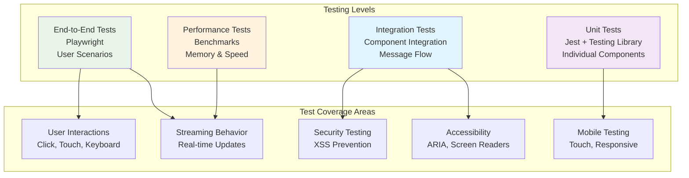

### Test Data Flow

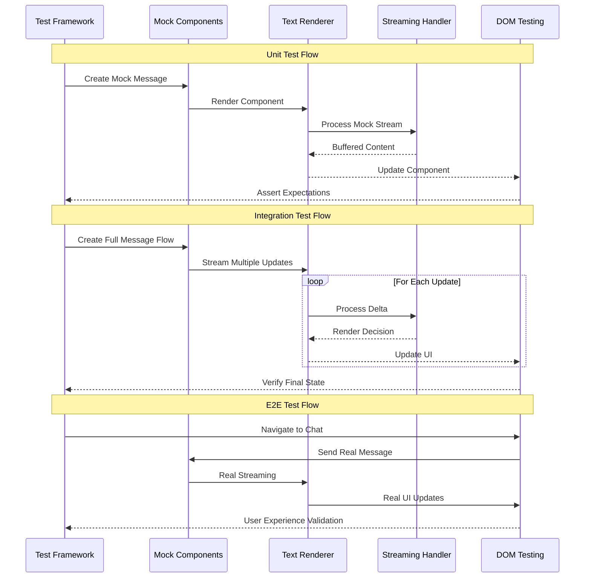

### Unit Testing (Jest + Testing Library)

```typescript
// Example: ExpandableContainer.test.ts
describe('ExpandableContainer', () => {
  test('expands and collapses on click', async () => {
    const { getByRole, queryByText } = render(ExpandableContainer, {
      title: 'Test Content',
      collapsible: true
    });
    
    const button = getByRole('button');
    const content = queryByText('Content inside');
    
    expect(content).toBeInTheDocument();
    
    await fireEvent.click(button);
    expect(content).not.toBeInTheDocument();
  });
  
  test('auto-collapses when not latest', async () => {
    const component = render(ExpandableContainer, {
      isLatest: true,
      expanded: true
    });
    
    await component.rerender({ isLatest: false });
    expect(component.queryByText('Content')).not.toBeInTheDocument();
  });
});
```

### Integration Testing (Playwright)

```typescript
// Example: message-rendering.spec.ts
test('message rendering flow', async ({ page }) => {
  await page.goto('/chat/test-chat');
  
  // Test streaming text message
  await page.waitForSelector('[data-testid="message-0"]');
  
  // Verify markdown rendering
  const codeBlock = page.locator('pre code');
  await expect(codeBlock).toHaveClass(/language-javascript/);
  
  // Test expand/collapse
  await page.click('[data-testid="reasoning-toggle"]');
  await expect(page.locator('[data-testid="reasoning-content"]')).toBeVisible();
  
  // Test auto-collapse when new message arrives
  await page.click('[data-testid="send-button"]');
  await expect(page.locator('[data-testid="reasoning-content"]')).toBeHidden();
});
```

### Performance Testing

```typescript
// Performance benchmarks
describe('Performance', () => {
  test('renders 100 messages under 500ms', async () => {
    const start = performance.now();
    
    const messages = Array.from({ length: 100 }, (_, i) => 
      createMockMessage(`Message ${i}`)
    );
    
    render(ChatView, { messages });
    
    const duration = performance.now() - start;
    expect(duration).toBeLessThan(500);
  });
  
  test('streaming updates under 16ms (60fps)', async () => {
    const { component } = render(TextRenderer, {
      message: createStreamingMessage()
    });
    
    const start = performance.now();
    await component.$set({ 
      message: { ...message, content: message.content + ' new content' }
    });
    const duration = performance.now() - start;
    
    expect(duration).toBeLessThan(16);
  });
});
```

## Performance Considerations

### Performance Monitoring Architecture

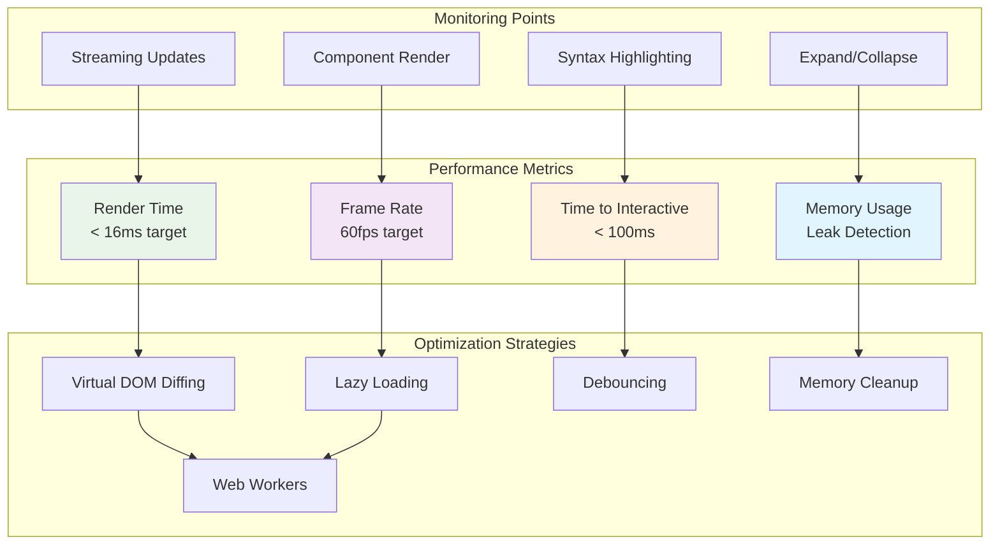

### Performance Optimization Flow

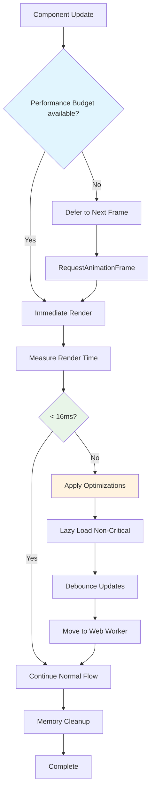

### Memory Management

Cleanup strategy for components:

```typescript
// Cleanup strategy for components
class MessageComponentManager {
  private activeComponents = new Set<ComponentInstance>();
  private observerPool = new Map<string, IntersectionObserver>();
  
  registerComponent(component: ComponentInstance) {
    this.activeComponents.add(component);
    this.setupIntersectionObserver(component);
  }
  
  private setupIntersectionObserver(component: ComponentInstance) {
    const observer = new IntersectionObserver((entries) => {
      entries.forEach(entry => {
        if (!entry.isIntersecting) {
          // Cleanup non-visible components
          this.cleanupComponent(component);
        }
      });
    }, { threshold: 0 });
    
    observer.observe(component.element);
    this.observerPool.set(component.id, observer);
  }
  
  private cleanupComponent(component: ComponentInstance) {
    // Remove event listeners
    // Clear timers
    // Release references
    this.activeComponents.delete(component);
  }
}
```

### Lazy Loading Strategy

```typescript
// Dynamic imports for performance
export async function loadRenderer(messageType: string): Promise<MessageRenderer> {
  switch (messageType) {
    case 'text':
      return (await import('./renderers/TextRenderer.svelte')).default;
    case 'reasoning':
      return (await import('./renderers/ReasoningRenderer.svelte')).default;
    case 'tool_call':
      return (await import('./renderers/ToolCallRenderer.svelte')).default;
    default:
      return (await import('./renderers/DefaultRenderer.svelte')).default;
  }
}
```

## Error Handling & Fallbacks

## Error Recovery & Resilience Architecture

### Error Recovery Architecture

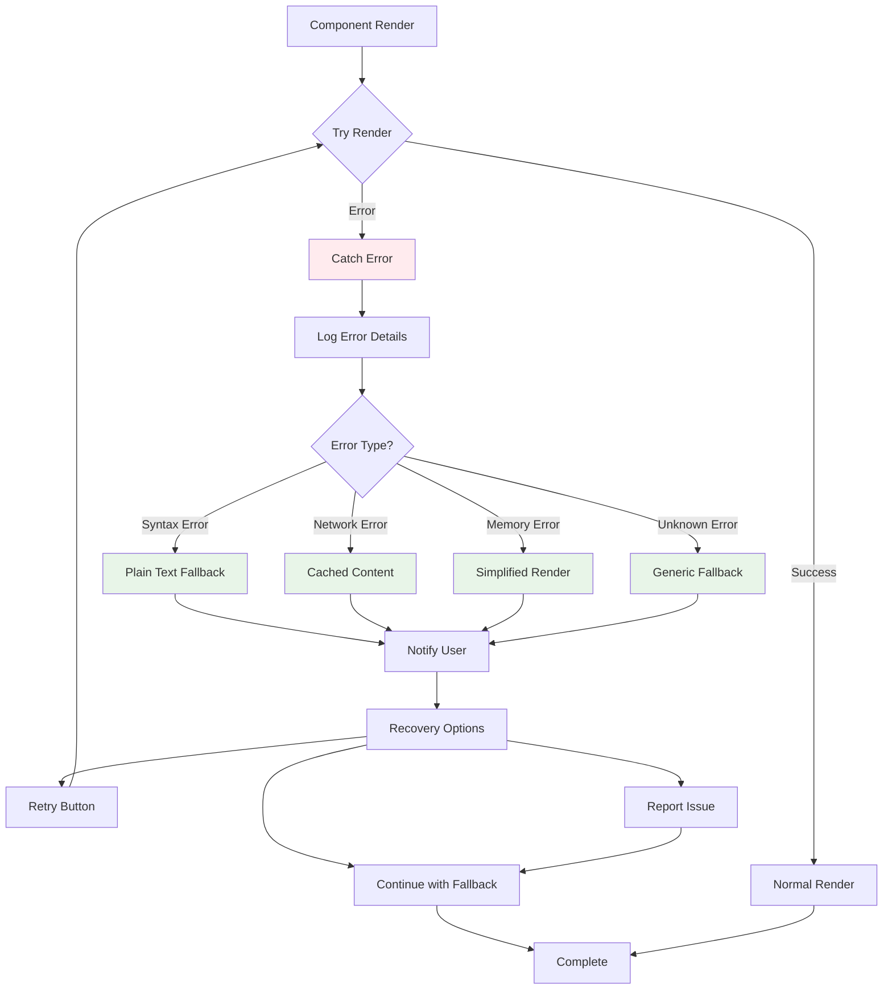

### Graceful Degradation Strategy

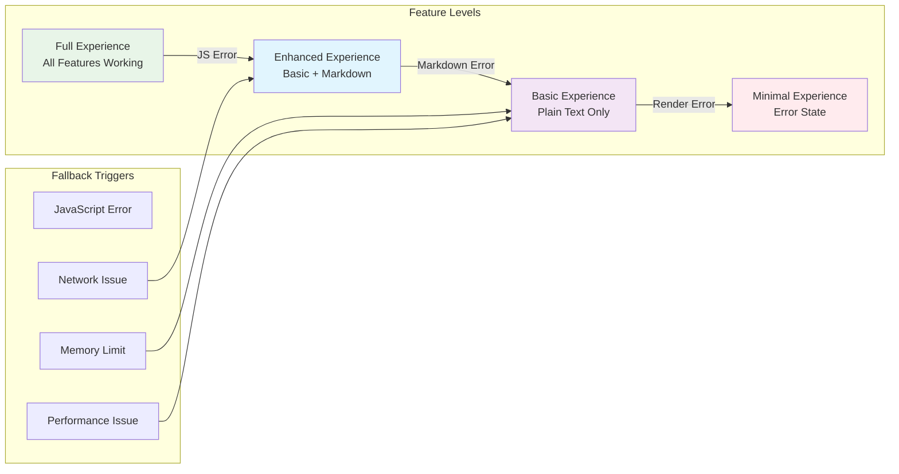

```typescript
// Graceful degradation strategy
class RenderingErrorHandler {
  static handleRenderError(error: Error, message: MessageDto): ComponentInstance {
    console.error('Rendering failed:', error);
    
    // Fallback to plain text
    return this.createFallbackRenderer(message);
  }
  
  private static createFallbackRenderer(message: MessageDto): ComponentInstance {
    return {
      render: () => `<div class="error-fallback">${message.content || 'Message unavailable'}</div>`
    };
  }
}
```

This development specification provides a comprehensive, elegant architecture that enables incremental implementation while maintaining clean separation of concerns and high code quality throughout all phases of development.
